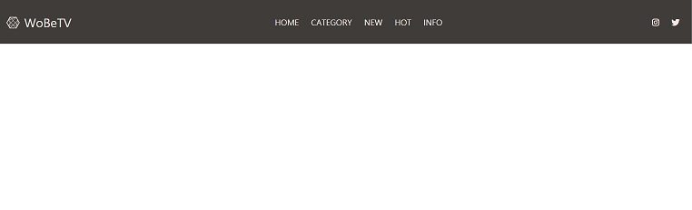
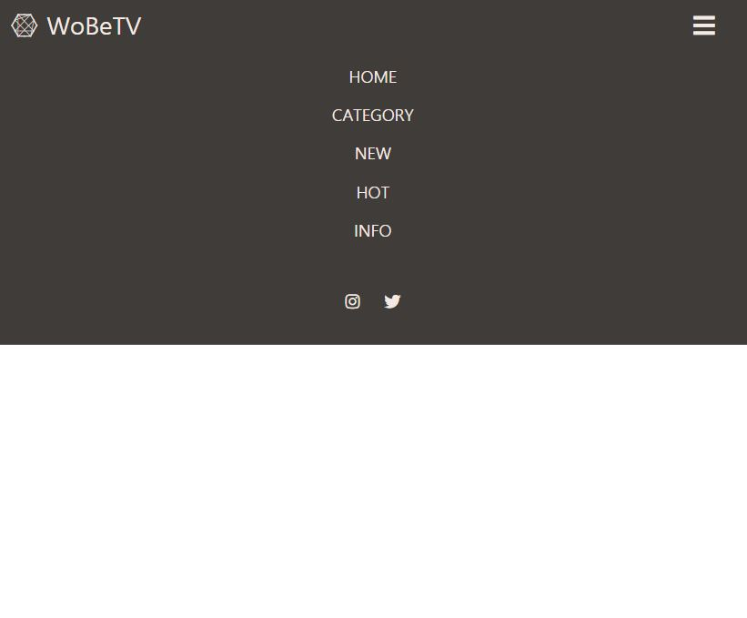
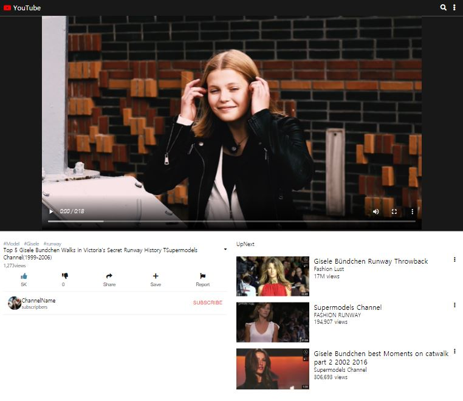
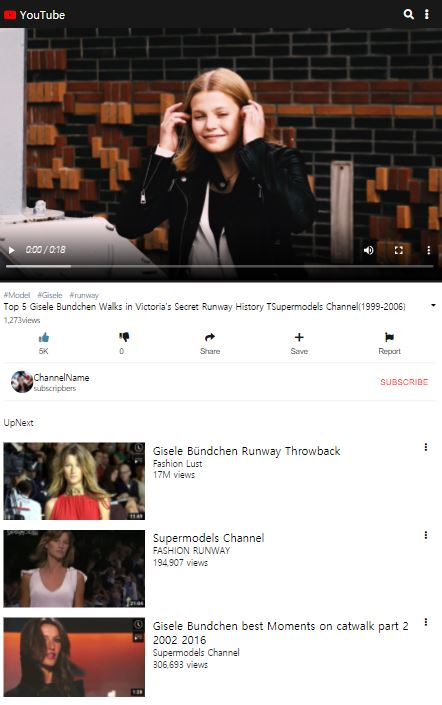
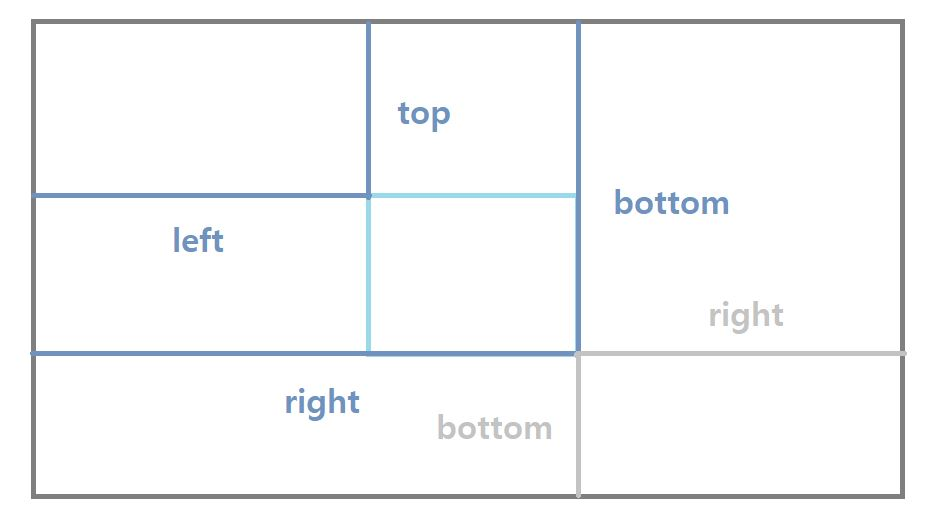
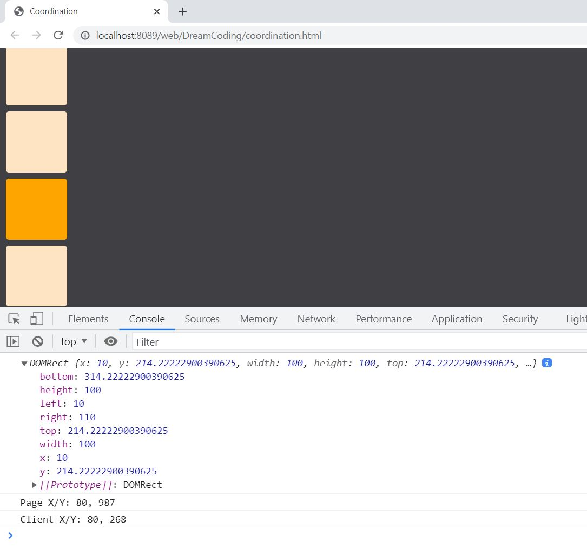
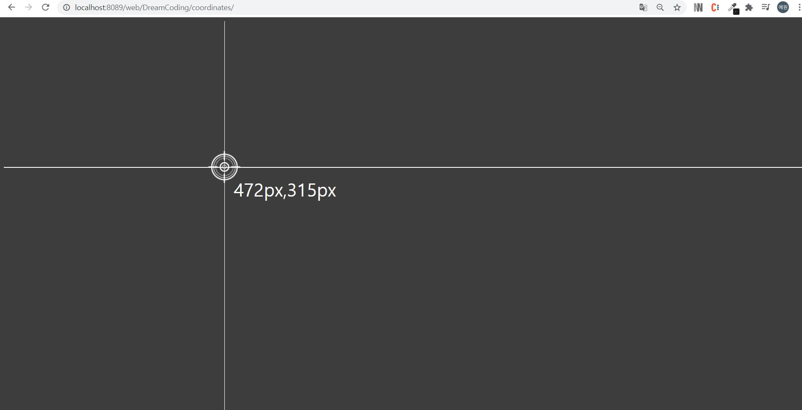
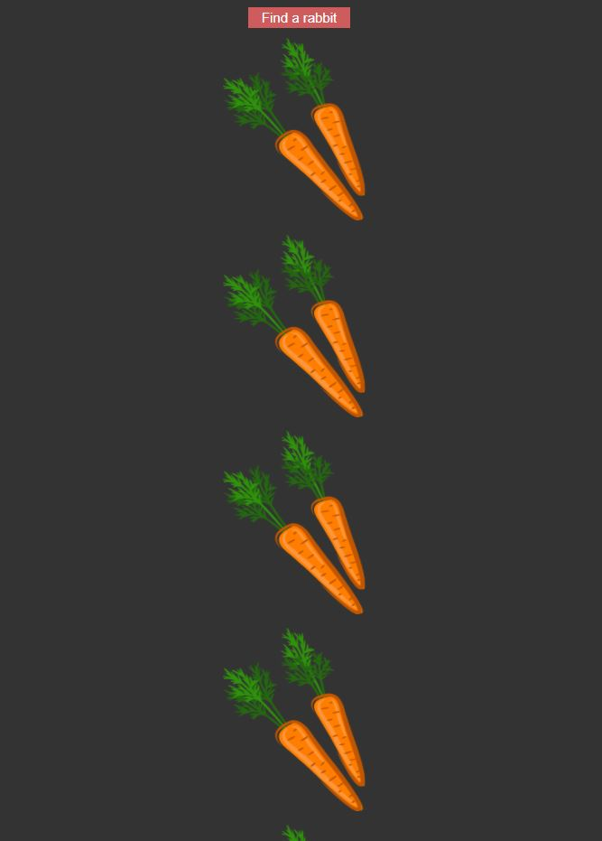
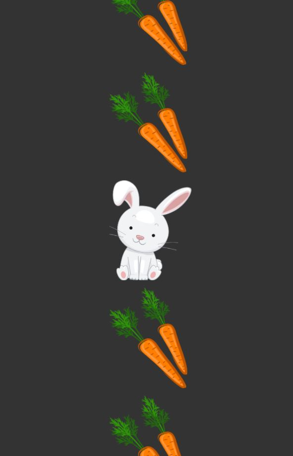
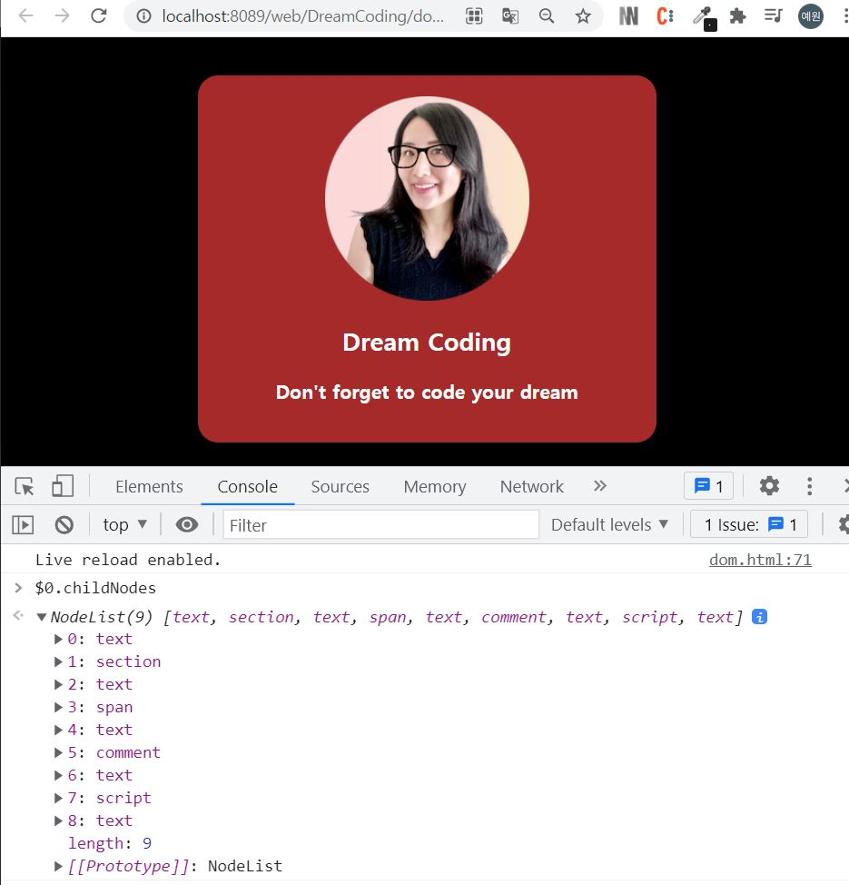

# web

## Day1

2021.09.11

반응형 navbar (HTML, CSS, javascript)

### Full_size

### Under_768px

#

## Day2

2021.09.12

반응형 youtube (HTML, CSS)

### Up_768px

### Under_768px

## Day3

2021.09.18

브라우저 크기, 좌표에 대해 이해하기

### 영역에 따른 크기

| 영역          |                       크기                       |
| ------------- | :----------------------------------------------: |
| `screen`      |         브라우저 외부 screen의 전체 크기         |
| `outer`       |           브라우저를 띄우는 가장 외곽            |
| `inner`       |  브라우저 내부의 contents영역(스크롤 **포함**))  |
| `clientWidth` | 브라우저 내부의 contents영역(스크롤 ~~마포함~~)) |

### 좌표

좌표 표기법

| 방향     | javascript |     css     |
| -------- | :--------: | :---------: |
| `top`    |    동일    |    동일     |
| `left`   |    동일    |    동일     |
| `bottom` | 상단 기준  |  하단 기준  |
| `right`  | 왼쪽 기준  | 오른쪽 기준 |

### pageX,pageY / clientX,clientY

**전체 페이지가 스크롤 될 만큼의 크기를 가진 경우**  
전체 페이지 화면에서의 x,y 좌표 => page 
현재 보여지는 화면에서의 x,y 좌표 => client  
(즉, 스크롤되는 페이지에서 하단 or 오른쪽은 당연히 page > client) 

| 방향      | coordination |
| --------- | :----------: |
| `pageX`   |      80      |
| `pageY`   |   **987**    |
| `clientX` |      80      |
| `clientY` |   **268**    |

## Day4

2021.09.19

좌표 활용하기

### 마우스 움직여 현재 좌표 출력하기

### 버튼 클릭 시 토끼가 있는 곳을 찾아가기

## Day5

2021.09.20

### DOM / DOM_Tree에 대해 이해하기

